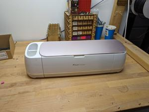
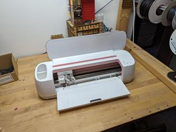
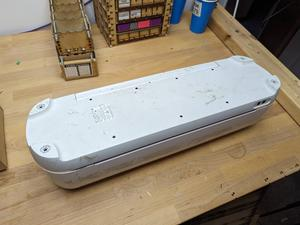
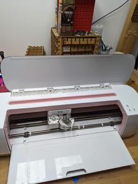
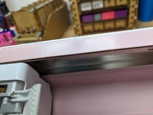
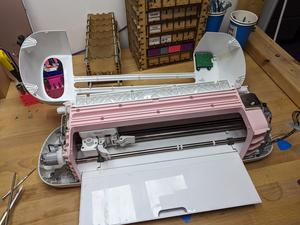
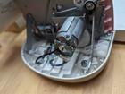
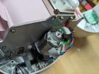

# Oomp Teardown Label Printer Niimbot D110
Oomp Teardown Label Printer Niimbot D110
disassembly youtube  
https://www.youtube.com/watch?v=wyUi8AG-vfo  
https://www.youtube.com/watch?v=6P9s3b0ZLs0
https://www.youtube.com/watch?v=LtGMsMsjEp4
https://www.youtube.com/watch?v=SUNwsj4OF90&t=1s
  
# disassembly

## step: 1 assembled
  
before starting

## step: 2 assembled and open
  
assembled and open

## step: 3 underneath
  
remove the four screws under the non slip pads (leave  the other screws)

## step: 4 remove the vanity plate cover
  
remove the top vanity plate cover. it is hot glued down at the top corner (notice broken pice), needs some convincing to come off. Then remove four torx screws

## step: 5 remove the hidden screws
  
remove the seven hidden screws, need a short screwdriver

## step: 6 remove the top cover
  
remove the top cover. careful with the cable connecting the control panel

# pcb

# parts_table
| designator | designator_image | oomp_key | note | description | description_long | mpn | lcsc | link | 
| --- | --- | --- | --- | --- | --- | --- | --- | --- | 
| motor1 |   |  | y axis, roller paper forward and back |  |  | HC385MG |  |  | 
| motor2 |   |  | x axis, knife head across |  |  | HC385MG |  |  | 
